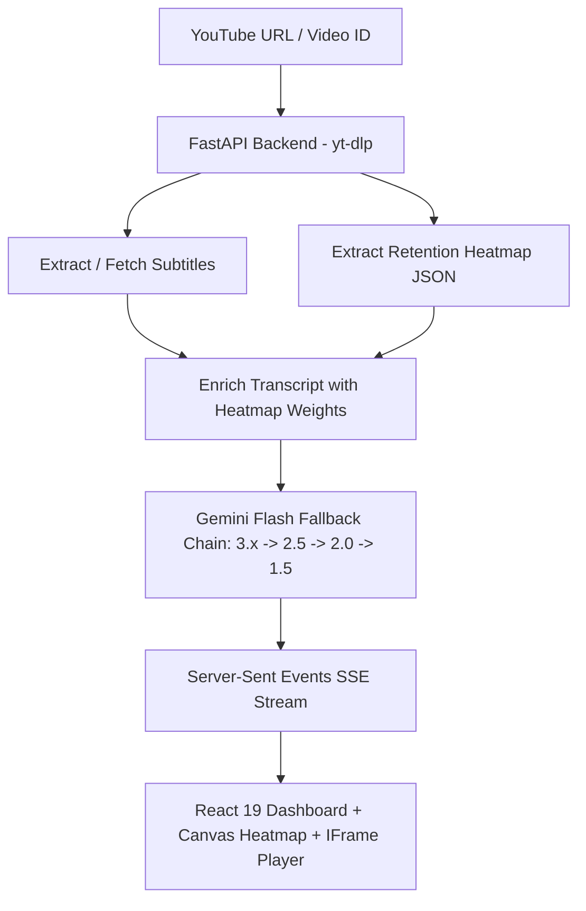

# 🎬 CHEAT CLIP PRO

> **AI Powered YouTube Auto Clipper** — Discover the most re-watched, high-energy moments in any YouTube video and turn them into viral Shorts, Reels, and TikToks in seconds.

[](#)
[](https://react.dev/)
[](https://fastapi.tiangolo.com/)
[](https://aistudio.google.com/)
[](LICENSE)

---

## 🧭 Table of Contents

- [✨ Features](#-features)
- [⚡ Quick Start](#-quick-start)
- [🔑 How to Get a Free Google Gemini API Key](#-how-to-get-a-free-google-gemini-api-key)
- [🎯 How to Use Cheat Clip Pro](#-how-to-use-cheat-clip-pro)
  - [Using the "Copy Timestamp" Features](#using-the-copy-timestamp-features)
  - [Searching Your Clip History](#searching-your-clip-history)
  - [Testing with Mock Mode (No Key Needed)](#testing-with-mock-mode-no-key-needed)
- [🛠️ Troubleshooting & FAQ (Beginner-Friendly)](#️-troubleshooting--faq-beginner-friendly)
- [🖥️ Tech Stack & Architecture (For Developers)](#️-tech-stack--architecture-for-developers)
- [📜 Available Terminal Commands](#-available-terminal-commands)
- [📡 API Reference](#-api-reference)
- [📄 License](#-license)

---

## ✨ Features

- 📊 **Audience Retention Heatmaps** — Scrapes real YouTube player engagement data to pinpoint where viewers rewound and re-watched the most.
- 🧠 **Multi-Version Gemini AI Analysis** — Scans transcripts with Google Gemini to identify hooks, punchlines, and viral story arcs. Includes an automatic multi-model fallback chain (Gemini 3.x, 2.5, 2.0, 1.5 Flash).
- ⏱️ **Selectable Timestamp Copying**:
  - **Only Timestamps** (`01:23 - 01:53`) — Perfect for timeline video editing.
  - **With Title Info** (`01:23 - 01:53 | Clip Title`) — Great for planning and notes.
  - **YouTube Chapters** (`01:23 Clip Title`) — Paste directly into your YouTube description to create clickable chapters!
- 🕒 **Interactive Video Player** — Plays the selected clip directly in the app, with auto-seek, loop, and playback tracking.
- 🎯 **Custom Focus Prompts** — Ask the AI to look for specific topics (e.g., *"Find funny moments"*, *"Extract marketing tips"*).
- 🔍 **Real-Time Clip & History Search** — Search through past analyses by video title, URL, clip title, or spoken quotes.
- 📝 **Subtitles Flexibility** — Works with automatic YouTube captions, or lets you upload your own SRT/TXT transcripts for live streams or uncaptioned videos.
- 🌐 **Bilingual Interface** — Seamless toggle between English and Indonesian (Bahasa Indonesia).

---

## ⚡ Quick Start

### Prerequisites
- [Node.js](https://nodejs.org/) (v18+)
- [Python](https://www.python.org/downloads/) (3.10+)
- [Git](https://git-scm.com/)

### Installation & Running

1. **Clone the repository**:
   ```bash
   git clone https://github.com/your-username/cheat-clip-pro.git
   cd cheat-clip-pro
   ```

2. **Install dependencies**:
   ```bash
   npm install
   python -m pip install -r backend/requirements.txt
   ```

3. **Start the application**:
   ```bash
   npm run dev
   ```
   Both the Vite frontend (`http://localhost:5173`) and the FastAPI backend (`http://localhost:8000`) will launch concurrently.

---

## 🔑 How to Get a Free Google Gemini API Key

Cheat Clip Pro uses Google's AI to find viral moments. Getting a key is **100% free** and requires **no credit card**:

1. Go to **[Google AI Studio](https://aistudio.google.com/)**.
2. Sign in with any Google account.
3. Click the blue **"Get API key"** button (or click **"Create API key"**).
4. Select a project (or click *"Create API key in new project"*).
5. Copy the generated key (it starts with `AIzaSy...`).
6. Paste it into the **Gemini API Key** field in the Cheat Clip Pro app.
   - The app will securely save your key in your browser's local storage so you won't have to enter it again!

---

## 🎯 How to Use Cheat Clip Pro

1. **Paste a YouTube URL** into the main input box (e.g. `https://www.youtube.com/watch?v=dQw4w9WgXcQ`).
2. **Enter your Gemini API Key** (or enter `mock` to try test data).
3. **Choose your Clip Duration**:
   - `⚡ Short (~15s)` — Great for quick punches and TikToks.
   - `🔥 Standard (~30s)` — Ideal for YouTube Shorts & Instagram Reels.
   - `📖 Extended (~60s)` — Best for detailed stories and podcasts.
4. *(Optional)* **Set a Topic Focus Prompt** (e.g., *"Highlight the funniest jokes"* or *"Find actionable advice"*).
5. Click **"⚡ Analyze Video with Gemini AI"**.
6. Within seconds, watch the real-time progress bar stream the retention heatmap and identified viral moments!

---

### Using the "Copy Timestamp" Features

Cheat Clip Pro makes copying timestamps fast for video editors and YouTube creators:

- **Copy a Single Timestamp**:
  - Click the **`⏱️ 01:23 - 01:53`** badge on any clip card, or click the **`⏱️ Copy Timestamp`** button at the bottom of the card.
- **Copy All Timestamps (Selectable Format)**:
  - Click the **`⏱️ Copy Timestamps ▾`** button (available in both the export toolbar and the Left Panel overview).
  - Select your desired format:
    1. **⏱️ Only Timestamps** — Copies pure time ranges (`01:23 - 01:53`) for video editors like Premiere Pro, DaVinci Resolve, or CapCut.
    2. **📝 With Title Info** — Copies timestamps with titles (`01:23 - 01:53 | Clip Title`) for video outlines.
    3. **📺 YouTube Chapters** — Copies in YouTube-ready format (`01:23 Clip Title`). Paste this straight into your video description to generate chapters!

---

### Searching Your Clip History

Cheat Clip Pro keeps a highlighted **Previously Analyzed Clips** panel on your dashboard:
- Type in the search box to filter past videos by **video title**, **YouTube link**, **clip title**, or **spoken quote**.
- Click **"📂 Load Results"** on any past video to instantly view the heatmap and clips again without using any API quota!
- Accidental deletion protection: The **"🗑 Clear All"** button includes a confirmation prompt to keep your history safe.

---

### Testing with Mock Mode (No Key Needed)

Want to see how the app looks before getting an API key?
- In the **Gemini API Key** field, type: **`mock`**
- Submit any YouTube URL.
- The app will instantly generate a simulated analysis with realistic heatmap and clips so you can explore the interface risk-free.

---

## 🛠️ Troubleshooting & FAQ (Beginner-Friendly)

### ❓ "'git' is not recognized as an internal or external command"
- **Why this happens:** Git is not installed yet or was installed while your command prompt was already open.
- **Solution:** Download and install Git from [git-scm.com/downloads](https://git-scm.com/downloads), then close and re-open your terminal or command prompt window.

---

### ❓ "'python' is not recognized as an internal or external command"
- **Why this happens:** Python was installed without the PATH checkbox enabled.
- **Solution:** Re-open your downloaded Python installer, click **Modify**, and make sure **`Add Python to environment variables (PATH)`** is checked. Then close and re-open your terminal.

---

### ❓ "'npm' or 'node' is not recognized"
- **Why this happens:** Node.js was just installed while the command prompt window was already open.
- **Solution:** Close the command prompt or terminal window completely and open a new one.

---

### ❓ "Port 8000 or 5173 is already in use"
- **Why this happens:** An earlier instance of Cheat Clip Pro or another server is still running in the background.
- **Solution:**
  - On Windows: Press `Ctrl + Shift + Esc` (Task Manager), look for `node.exe` or `python.exe`, and click "End Task".
  - Or restart your computer.

---

### ❓ "Transcript not found for this video"
- **Why this happens:** The YouTube video has disabled captions or has no spoken dialogue.
- **Solution:**
  - Select the **"Manual Upload (SRT / Text)"** option right below the URL bar.
  - Paste any transcript text or upload an `.srt` file, and Cheat Clip Pro will analyze it seamlessly!

---

### ❓ "Quota limit reached / Error 429"
- **Why this happens:** Google's free Gemini tier has minute/day rate limits.
- **Solution:**
  - Cheat Clip Pro **automatically tries all available Flash models** (3.7, 3.5, 2.5, 2.0, 1.5) before giving up!
  - If all free models are temporarily busy, wait 1-2 minutes and try again.
  - You can also click the red **"🔑 Change API Key"** button to generate a new free key from a different Google account.

---

## 🖥️ Tech Stack & Architecture (For Developers)



| Layer | Technology | Key Files |
|---|---|---|
| **Frontend** | React 19 · TypeScript · Vite · Canvas API | [src/App.tsx](file:///e:/PROJECT/CLIPPER/cheat-clip-pro/src/App.tsx) · [src/main.tsx](file:///e:/PROJECT/CLIPPER/cheat-clip-pro/src/main.tsx) |
| **Styling** | Vanilla CSS Dark System · Glassmorphism | [src/index.css](file:///e:/PROJECT/CLIPPER/cheat-clip-pro/src/index.css) |
| **Backend** | Python 3.10+ · FastAPI · Uvicorn (SSE streaming) | [backend/main.py](file:///e:/PROJECT/CLIPPER/cheat-clip-pro/backend/main.py) |
| **Video Processing** | `yt-dlp` · `youtube-transcript-api` | [backend/main.py](file:///e:/PROJECT/CLIPPER/cheat-clip-pro/backend/main.py) · [backend/requirements.txt](file:///e:/PROJECT/CLIPPER/cheat-clip-pro/backend/requirements.txt) |
| **AI Integration** | `google-genai` Python SDK with dynamic version fallback | [backend/main.py](file:///e:/PROJECT/CLIPPER/cheat-clip-pro/backend/main.py) |
| **Localization** | Custom bilingual reactivity (English / Indonesian) | [src/locales/en.ts](file:///e:/PROJECT/CLIPPER/cheat-clip-pro/src/locales/en.ts) · [src/locales/id.ts](file:///e:/PROJECT/CLIPPER/cheat-clip-pro/src/locales/id.ts) |

---

## 📜 Available Terminal Commands

| Command | Description |
|---|---|
| `npm run dev` | Starts both the Vite frontend (port 5173) and FastAPI backend (port 8000) concurrently |
| `npm run dev-frontend` | Starts only the Vite frontend dev server |
| `npm run dev-backend` | Starts only the Python FastAPI server with hot-reload |
| `npm run build` | Compiles TypeScript and builds the production frontend bundle (`dist/`) |
| `npm run preview` | Previews the production build locally |
| `npm run lint` | Runs ESLint code quality checks |

---

## 📡 API Reference

The backend exposes the following REST & streaming endpoints at `http://localhost:8000`:

### 1. `GET /api/health`
Returns the status of the backend API.
```json
{ "status": "ok", "message": "CHEAT CLIP PRO API is active" }
```

### 2. `GET /api/models?api_key=AIza...`
Discovers and lists all Flash models compatible with the provided key, sorted descending by version.
```json
{
  "models": ["gemini-2.5-flash", "gemini-2.5-flash-lite", "gemini-2.0-flash", "gemini-1.5-flash"]
}
```

### 3. `POST /api/analyze`
Starts video scraping and AI extraction. Streams progress updates in real time using Server-Sent Events (SSE).

**Request Body:**
```json
{
  "url": "https://www.youtube.com/watch?v=VIDEO_ID",
  "duration": "30s",
  "api_key": "your_gemini_api_key",
  "model": "gemini-2.5-flash",
  "custom_prompt": "Find top trading tips",
  "range_start": 60.0,
  "range_end": 300.0,
  "subtitles": null,
  "target_clip_count": 10
}
```

---

## 📁 Project Structure

```text
cheat-clip-pro/
├── backend/
│   ├── main.py              # FastAPI server, yt-dlp extractor, Gemini model fallback
│   ├── requirements.txt     # Python backend dependencies
│   ├── .env.template        # Environment template (local configuration)
│   └── .env                 # Local environment config (optional)
├── src/
│   ├── App.tsx              # Main dashboard, clip renderer, YouTube player, copy actions
│   ├── components/
│   │   └── HeatmapTimeline.tsx # Canvas-based interactive retention heatmap
│   ├── locales/
│   │   ├── en.ts            # English translations
│   │   └── id.ts            # Indonesian translations
│   ├── types.ts             # TypeScript definitions
│   ├── index.css            # Dark mode styles, glassmorphism, animations
│   └── main.tsx             # React entry point
├── package.json             # Scripts & npm dependencies
└── vite.config.ts           # Vite configuration & dev server
```

---

## 📄 License

Distributed under the **MIT License**. See `LICENSE` for more information.

<p align="center">
  Built with ❤️ for content creators, video editors, and social media managers.
</p>
